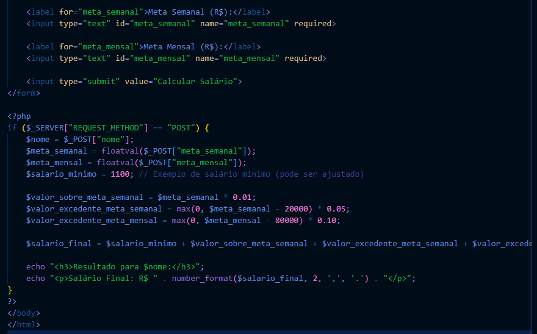
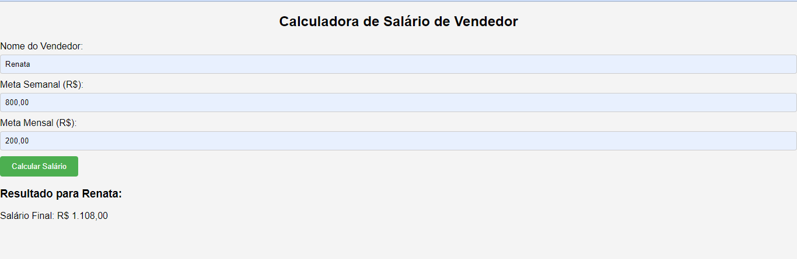

README Sistema de Salário:

𝐖𝐄𝐋𝐂𝐎𝐌𝐄...

# Índice˚˖𓍢ִִ˚🍁ֶָ֢ ⋅

[ Projeto - Sistema de salário](#projeto---Sistema de salário)

[Descriçao](#descri%C3%A7ao)  

[Introduçao](#introdu%C3%A7ao)  

[Funcionalidade](#funcionalidade) 

[Tecnologias-utilizadas](#tecnologias-ultilizadas)  

[Fontes-consultadas](#fontes-consultadas)

[Autores](#autores)  

## DESCRIÇÃO💗᪲᪲᪲
A calculadora de salário de vendedor em PHP é uma aplicação que permite aos gestores de vendas e aos próprios vendedores estimarem seus ganhos de acordo com o desempenho alcançado. A aplicação recebe como entrada as metas de vendas semanais e mensais do vendedor e, com base nessas informações, realiza os cálculos necessários para determinar o salário final.

︵‿︵‿︵‿︵︵‿︵‿︵‿︵︵‿︵‿︵‿︵︵‿︵‿︵‿︵︵‿︵‿︵‿︵︵‿︵‿︵‿︵︵‿︵‿︵‿︵︵‿︵‿︵‿︵︵‿︵‿︵‿︵︵‿︵‿︵‿︵︵‿︵‿︵‿︵

## Introdução𓍢ִ໋🌷͙֒
O projeto em questão apresenta uma aplicação web desenvolvida em PHP, voltada para o cálculo do salário de um vendedor com base em suas metas de vendas semanais e mensais. Esta ferramenta proporciona uma maneira eficiente e precisa de determinar o salário final do vendedor, levando em consideração diversas porcentagens de comissão aplicadas sobre as vendas realizadas.

︵‿︵‿︵‿︵︵‿︵‿︵‿︵︵‿︵‿︵‿︵︵‿︵‿︵‿︵︵‿︵‿︵‿︵︵‿︵‿︵‿︵︵‿︵‿︵‿︵︵‿︵‿︵‿︵︵‿︵‿︵‿︵︵‿︵‿︵‿︵︵‿︵‿︵‿︵

## ✎Funcionalidades✎:

 *Calcula o salário final de um vendedor com base em suas metas semanais e mensais de vendas.
*Exibe o resultado de forma clara e precisa.

´´Explicando melhor``...

´´-1.Entrada de Dados:`` A aplicação permite que o usuário insira as metas de vendas semanais e mensais do vendedor através de um formulário intuitivo.

´´-2.Cálculo de Comissão:`` Com base nas metas de vendas e nas porcentagens de comissão predefinidas, a aplicação calcula a comissão a ser recebida pelo vendedor.

´´-3.Determinação do Salário Final:`` Utilizando as informações de vendas e as comissões calculadas, a aplicação determina o salário final do vendedor, somando o salário base com a comissão.

´´-4.Flexibilidade de Configuração:`` A aplicação permite que os gestores configurem diferentes porcentagens de comissão, adaptando-se às políticas da empresa ou às necessidades específicas de cada vendedor.

´´-5.Visualização dos Resultados:`` Após o cálculo, a aplicação exibe de forma clara e organizada o salário final do vendedor, fornecendo uma visão transparente dos ganhos potenciais.

︵‿︵‿︵‿︵︵‿︵‿︵‿︵︵‿︵‿︵‿︵︵‿︵‿︵‿︵︵‿︵‿︵‿︵︵‿︵‿︵‿︵︵‿︵‿︵‿︵︵‿︵‿︵‿︵︵‿︵‿︵‿︵︵‿︵‿︵‿︵︵‿︵‿︵‿︵

## Códigos

´´O código HTML e PHP abaixo mostra a estrutura da calculadora de salário de vendedor:``

## 🌟Tecnologias Utilizadas🌟
- ``PHP``
- ``HTML``  
- ´´CSS``
- ``GitHub``
- ``Visual Studio Code``

 ## Fontes Consultadas🔍
[Inteligência Artifcial](https://chat.openai.com/)     
[w3schools](https://www.w3schools.com/)       
[Alura](https://www.alura.com.br/artigos/escrever-bom-readme)

︵‿︵‿︵‿︵︵‿︵‿︵‿︵︵‿︵‿︵‿︵︵‿︵‿︵‿︵︵‿︵‿︵‿︵︵‿︵‿︵‿︵︵‿︵‿︵‿︵︵‿︵‿︵‿︵︵‿︵‿︵‿︵︵‿︵‿︵‿︵︵‿︵‿︵‿︵︵‿

-⌨Este README fornece uma visão geral do projeto, incluindo detalhes sobre seu funcionamento, cálculos das porcentagens, 
exemplos e a estrutura dos commits. Espero que isso ajude! Se precisar de mais alguma coisa, sinta-se à vontade para perguntar.⌨

︵‿︵‿︵‿︵︵‿︵‿︵‿︵︵‿︵‿︵‿︵︵‿︵‿︵‿︵︵‿︵‿︵‿︵︵‿︵‿︵‿︵︵‿︵‿︵‿︵︵‿︵‿︵‿︵︵‿︵‿︵‿︵︵‿︵‿︵‿︵︵‿︵‿︵‿︵︵‿

## Autorꕥ
[Nicolly da Silva D'avila](https://github.com/NickSilvaDavila)

